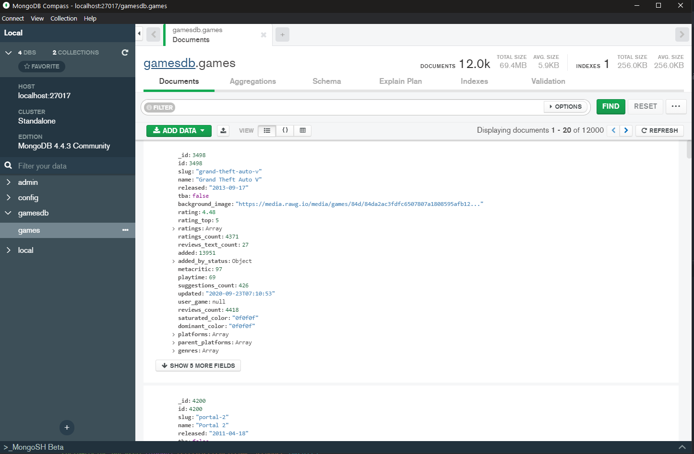

## Rawg-Scraper

Nodejs Script to collect data from the RAWG website.

## Motivation

Collect some dummy data to develop personal project RAWG clone in GoLang.

## Node packages used:

- [axios](https://www.npmjs.com/package/axios)
- fs
- [mongodb](https://www.npmjs.com/package/mongodb)

## Woking:

- Make Req to API
- Modiy data (only \_id)
- Insert that data into the MongoDB

## Run

Change pageDone in `pagedone.json`

```bash
node index.js
```

## Notes

I have successfully collect 12000 games dummy data using this scraper

## Screenshot


## License
Use only for personal project.

MIT License

Copyright (c) 2021 Chetan Pandey
